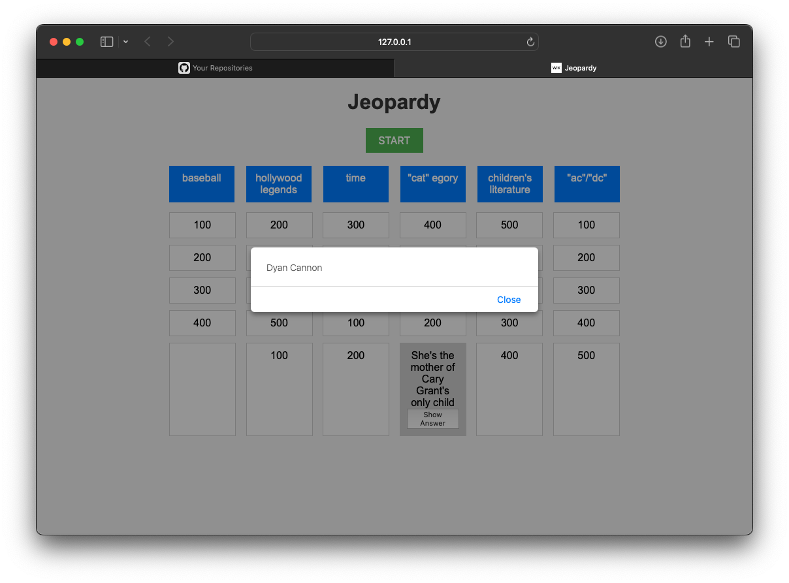

JavaScript Jeopardy game brings the excitement of the classic quiz show to your browser. With real-time API integration, it offers dynamic game boards with varied categories and difficulty levels. Play solo or challenge friends in multiple game modes, all with customizable settings. The intuitive interface makes gameplay easy and engaging, while score tracking keeps the competition alive. Ready to become a Jeopardy champion? Play now and test your knowledge!

HOW TO RUN 
------------------------------------
* To get started, navigate to the Jeopardy repository on GitHub and download the files. Then, open the folder in Visual Studio Code and launch the live server extension. This action  will automatically open the project in your default web browser.

Click here to view live:
[Visit website](https://08milam.github.io/Jeopardy/)

TECHNOLOGY STACK USED
------------------------------------
* HTML
* CSS
* JavaScript
* api

